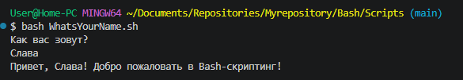
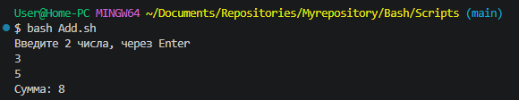
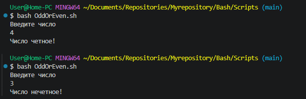
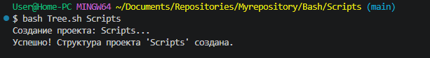
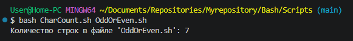
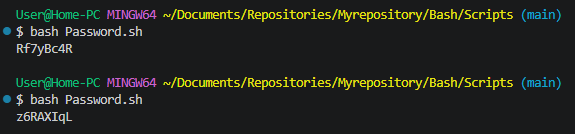

## Задания по Bash-скриптингу

[Задание 1 (имя)](./Scripts/WhatsYourName.sh)

[Задание 2 (сумма)](./Scripts/Add.sh)

[Задание 3 (четность)](./Scripts/OddOrEven.sh)

[Задание 4 (структура)](./Scripts/Tree.sh)

[Задание 5 (строки в файлах)](./Scripts/CharCount.sh)

[Задание 6 (случайный пароль)](./Scripts/Password.sh)

