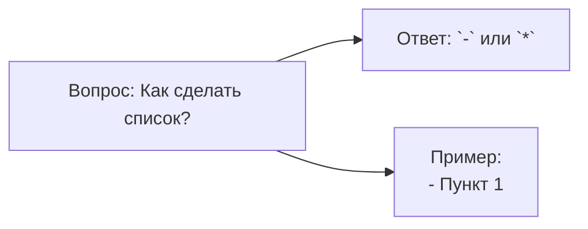
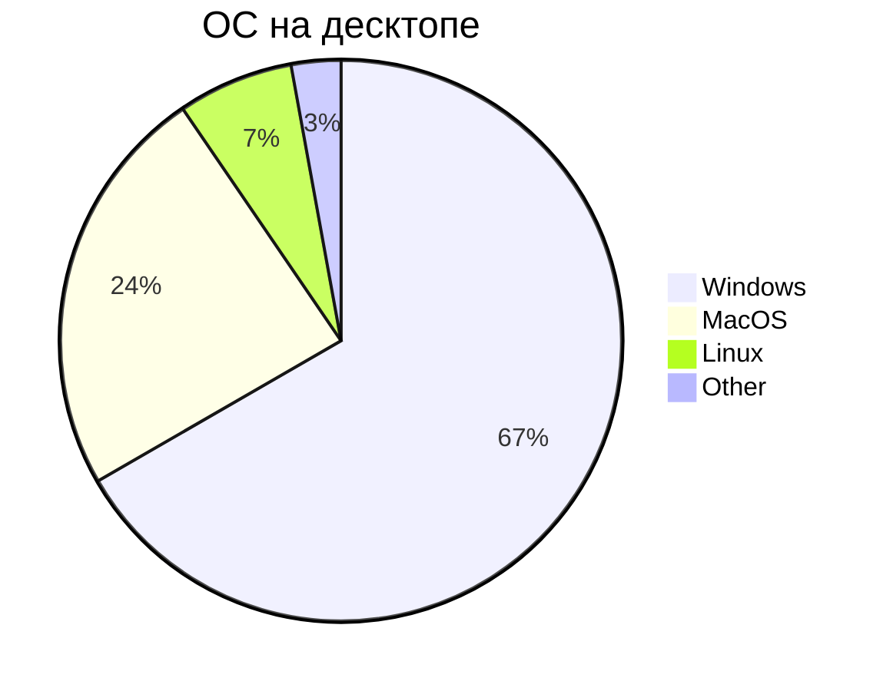

# Mermaid

**Mermaid** - это сильно упрощенный и далекий аналог UML - язык описания блок-схем, граффиков и диаграм с их визуализацией

> **Самостоятельно доделать этот документ**

## Блок-схемы:

### Базовая структура 1

- `flowchart` - блок-схема
- `LR` - направление вправо
- `LL` - направление влево
- `A[], B[], C[]` - прямоугольник
- `-->` - стрелка связи

### Базовая структура 2

### Полный синтаксис блок-схем

### Диаграмма последовательности

### Диаграмма Класса

### Диаграма Ганта

### Граф зависимостей

## Круговая диаграмма:

