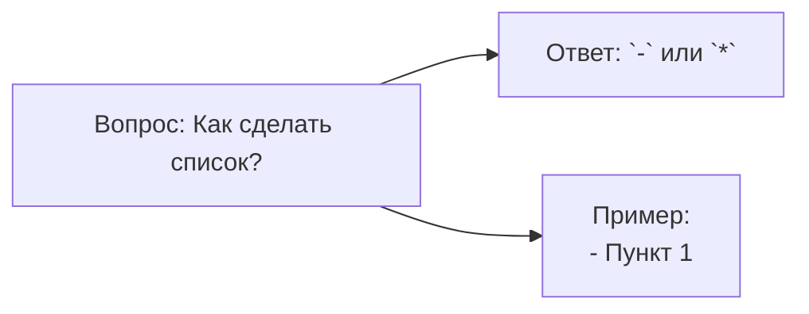
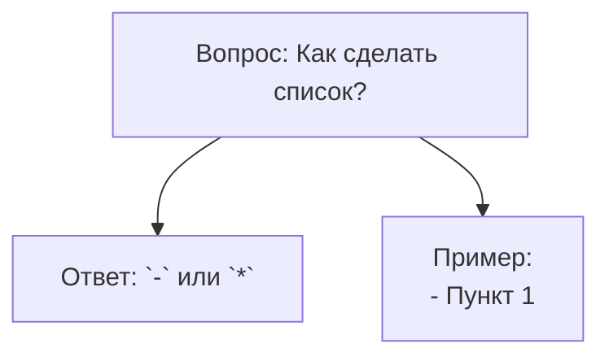
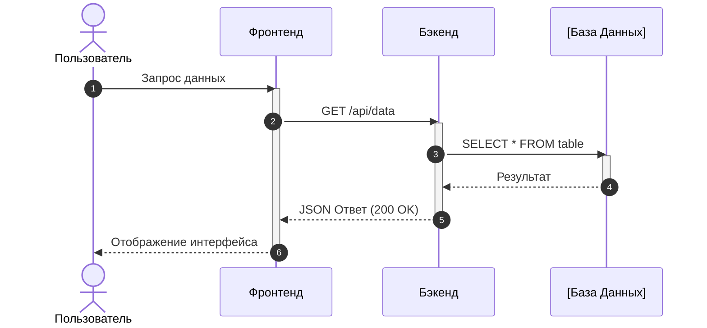
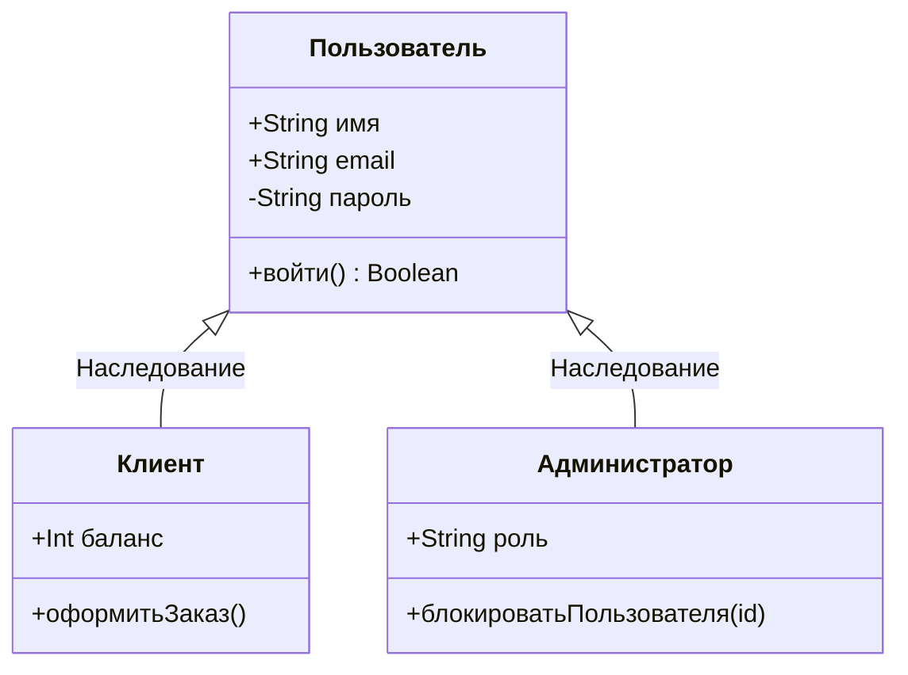
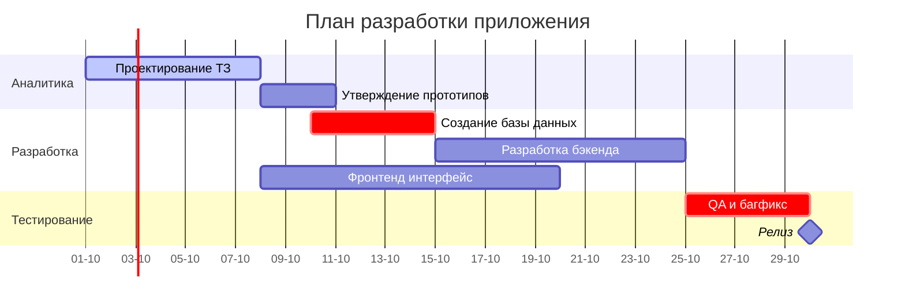
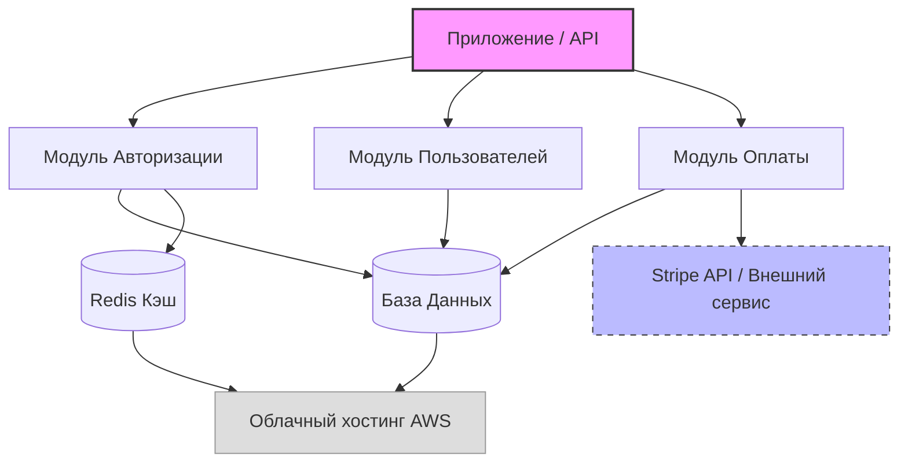
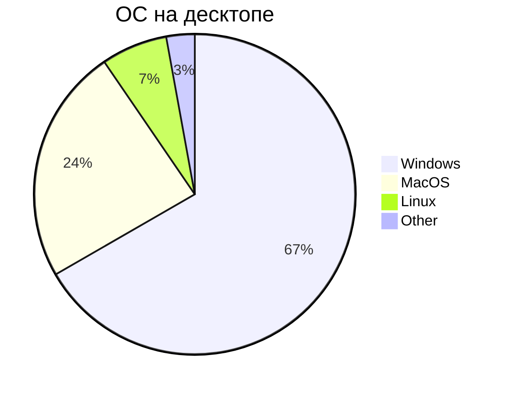

# Mermaid

**Mermaid** - это сильно упрощенный и далекий аналог UML - язык описания блок-схем, граффиков и диаграм с их визуализацией

> [x] **Самостоятельно доделать этот документ**

## Блок-схемы:

### Базовая структура 1

### Базовая структура 2

### Полный синтаксис блок-схем
- `flowchart` - блок-схема

#### Направления

- `LR` - направление вправо
- `LL` - направление влево
- `TD` - направление вних
- `BT` - направление вверх

#### Формы

- `A[]` - прямоугольник
- `B()` - скругленный прямоугольний
- `C(())` - круг
- `D{}` - ромб
- `E{{}}` - шестиугольник
- `F>]` - флаг

#### Стрелки

- `-->` - стрелка связи
- `---` - линия без стрелки
- `-.->` - пунктирная стрелка
- `-.-` - пунктирная линия
- `==>` - толстая стрелка
- `===` - толстая линия
- `-- Текст -->` - стрелка с текстом

### Диаграмма последовательности

### Диаграмма Класса

### Диаграма Ганта

### Граф зависимостей

## Круговая диаграмма:

